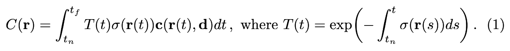

[nerf算法详解](https://www.bilibili.com/video/BV1fL4y1T7Ag/?share_source=copy_web&vd_source=352c13361db61e7b52de4768e36b25a0)

积分权重的计算：
* 采样点密度（不透明度），越不透明则对颜色累积贡献越大
* 如何描述一个采样点前面的遮挡？使用积分的方式，对光线沿途的不透明度进行积分记为A，然后使用exp(-A)来得到遮挡值，也就是说前面的物体越不透明，后续的采样点对颜色累积贡献越小

积分如何计算：首先当然是要离散化为采样点。先对采样范围$t_{near}到t_{far}$进行n等分，然后使用每段上采样点的不透明度乘上段长度作为一段不透明度的积分值。下图是积分公式
而实际离散后的加和公式为 
其中$\delta_i$为每段长度，$\sigma_i$为该段上采样点的不透明度（密度），$w_i$中的括号项即是描述该段上不透明度越大，则权重$w_i$越大。另一项$T_i$则是之前提到的前面的不透明度的积分。$c_i$即采样点的颜色值

