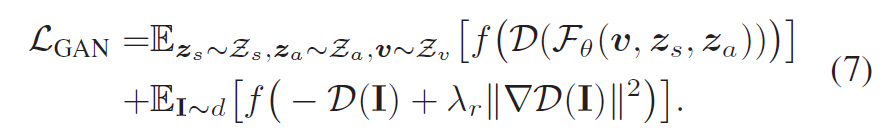
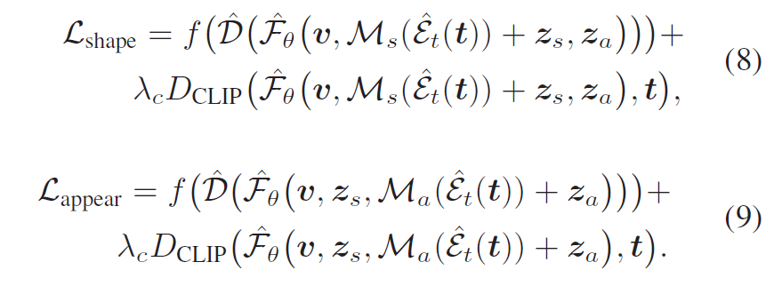

# CLIP Nerf总结

## 模型总体思路：

* disentangled Conditional Nerf：通过一个Deformation network，将输入的位置坐标和shape code映射为位置坐标的偏移量，然后再进行位置编码。将偏移后的位置编码输入cond nerf用来预测辐射场的密度值；然后将appearance code和view dir输入cond nerf预测辐射场颜色值。
  
  首先需要预训练一个disentangled conditional nerf，使用服从标准正态分布的shape code $z_s$, appearance code $z_a$以及camera pos $z_v$进行随机采样，同时使用服从分布$d$的real image来训练一个对抗网络，loss function为：
  

* CLIP部分：使用两个前向网络$M_s$和$M_a$分别对$z_s$和$z_a$进行更新。首先需要预训练一个CLIP编码器将输入的image或text prompt映射为CLIP embedding，随后将CLIP编码分别输入两个前向网络得到对应姿态下的$z_s$和$z_a$，作为解耦条件nerf的输入。

  $M_s$和$M_a$的训练损失函数如下所示，其中$D_{CLIP}表示两个CLIP编码的余弦距离。$

* Inverse Manipulation：对于训练使用的初始$z_s$和$z_a$以及相机属性$v$进行迭代优化。这段的目的有点没看懂

## 贡献点：

* 提出了首个针对nerf的联合文本和图像的编辑系统，使用户能够更方便的控制3D内容。
* 设计了解耦条件nerf（disentangled Conditional Nerf）
* 前向网络能够快速推断同一类别的不同物体（这里的同一类别定义有点不明确）
* 设计了一个从真实图片逆向得到shape和appearance code的方法。

## 相关工作

* GRAF和EditNerf提出了condition nerf的概念。
  * GRAF将conditional GAN引入nerf。nerf本身是通过多张不同的real image以及其对应的camera参数作为训练集，训练出一个渲染器。其缺点在于训练渲染器一定需要场景中的相机信息。但是GRAF通过训练一个generator，给出物体的shape和appearance code即可流畅地渲染不同视角中的物体。generator的训练细节具体来说就是：generator接受服从均匀分布的相机pos的编码作为输入，然后先于$z_s$做一次concatenate，经过MLP得到编码$h$，然后用来表示物体外型的密度场就可以使用$h$经过一个MLP进行预测；计算颜色则需要将$h$与相机dir编码和$z_a$做一次concatenate，同样经过一个MLP得到颜色场。最后将预测结果使用Discriminator进行训练。

    loss function、K采样加速训练等模型细节这里就先省略了。

    关于GRAF的解读这篇文章[NeRF与GAN的交融（四）](https://zhuanlan.zhihu.com/p/590673459)讲的挺清晰的，但是由于我目前对GAN没有了解，所以还需要学习一下具体方法才能比较好理解conditional nerf能做到不同视角流畅渲染物体的原因以及conditional gan的原理。

  * EditNerf：待调研

* CLIP-Driven Image Generation and Manipulation

  感觉对于本篇工作不算重点，我们应该关注CLIP embedding是如何通过映射函数得到更新的$z_s$和$z_a$

# Differentiable Design Galleries

概括来说：Neural DVR Analyzer接受$Image_{exemplar}$作为输入，然后将其映射为风格编码，然后Neural DVR Renderer使用一个基于视角生成的$Image_{viewport}$与上一步的风格编码进行训练，使$Image_{viewport}$的传输函数向$Image_{exemplar}$靠拢。最后使用一个discriminator进行训练优化。

具体细节先不做记录了，等周二开完会和潘波讨论一下再做记录，同时思考如何和CLIP nerf进行结合